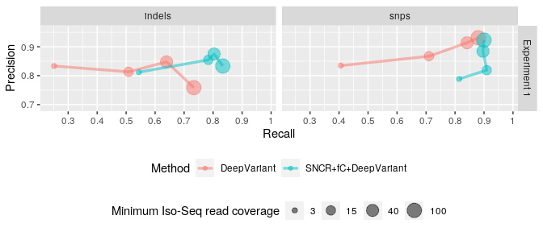
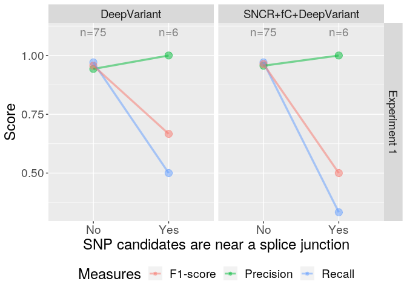

<!-- README.md is generated from README.Rmd. Please edit that file -->

# lrRNAseqBenchmark

(This is a draft)

`lrRNAseqBenchmark` is as `R` package that facilitates the validation of
genetic variants called from long-read RNA-seq (lrRNA-seq) data by one
or more variant callers, by comparing their VCF files with a
ground-truth VCF file (commonly generated from high-coverage short-read
data).

`lrRNAseqBenchmark` constructs a big data.frame (master table) that
contains information about the variants called by the methods to be
validated and the variants in the ground truth. From this master table,
many plots can be made by different functions available in the package
(`ggplot2`-base packages used internally), which allow the visial
analyses including variant proximity to splice junctions, variants in
homopolymers, and variants from allele specific expressed (ASE) genes.

## Installation

To install this package just type in your `R`

    devtools::install_github("vladimirsouza/lrRNAseqBenchmark@main")

## Reference manual

For a full list and description of all functions available in this
package, click
[here](https://github.com/vladimirsouza/lrRNAseqBenchmark/blob/main/documents/lrRNAseqBenchmark.pdf).

## An example on how to construct a master table

### Introduction

For less computational efforts, we use data only from chromosome 22.

Generate a master table to compare and validate the variant calls from
Iso-Seq data when using variant caller
[DeepVariant](https://github.com/google/deepvariant) alone and
DeepVariant combined with
[SplitNCigarReads](https://gatk.broadinstitute.org/hc/en-us/articles/360036858811-SplitNCigarReads)
and
[flagCorrection](https://github.com/vladimirsouza/lrRNAseqVariantCalling)
. The ground-truth VCF was generated by
[GATK](https://github.com/broadinstitute/gatk) pipeline on high-coverage
short-read DNA data.

### Files to download

-   [ORIGINAL\_BAM](https://zenodo.org/record/5979665/files/isoseq_chr21_22.bam),
    BAM file with Iso-Seq reads aligned to the reference.
-   [SNCR+fC\_BAM](https://zenodo.org/record/5979665/files/isoseq_sncr_fc_chr21_22.bam),
    BAM file after manipulations with `SplitNCigarReads` and
    `flagCorrection` in `ORIGINAL_BAM`.
-   [DeepVariant\_VCF](https://zenodo.org/record/5979665/files/deepvariant_chr21_22.vcf),
    VCF files with variants called from `ORIGINAL_BAM`.
-   [SNCR+fC+DeepVariant\_VCF](https://zenodo.org/record/5979665/files/sncr_fc_deepvariant_chr21_22.vcf),
    VCF files with variants called from `SNCR+fC+DeepVariant_VCF`.
-   [Ground-truth\_VCF](https://zenodo.org/record/5979665/files/ground_truth_chr21_22.vcf),
    VCF files with ground-truth variants called from high-coverage
    short-read DNA data.

### Input variables

``` r
### methods to validate
# name of the methods to validate
METHOD_NAMES <- c("dv", "sncr_fc_dv")
# name of the dataset used with the methods to validate
METHOD_DATASET_NAME <- "isoSeq_chr21_22"
# VCF files
METHOD_VCF_FILES <- c(
  "/home/vbarbo/master_table_example/data/deepvariant_chr21_22.vcf",
  "/home/vbarbo/master_table_example/data/sncr_fc_deepvariant_chr21_22.vcf"
)
# BAM of the data
METHOD_BAM_FILE <- "/home/vbarbo/master_table_example/data/isoseq_chr21_22.bam"


### ground-truth
# name
TRUTH_NAME <- "truth"
# name of the dataset used to generate the ground-truth
TRUTH_DATASET_NAME <- "shortRead_chr21_22"
# VCF file
TRUTH_VCF_FILE <- "/home/vbarbo/master_table_example/data/ground_truth_chr21_22.vcf"
# BAM file
TRUTH_BAM_FILE <- "/home/vbarbo/master_table_example/data/short_read_chr21_22.bam"


### variables
# the maximum distance (number of bases) of a variant from a splice junction to be
# consider near the splice junction
MAX_DIST_FROM_SPLICE_SITE <- 20
# number of threads to use
THREADS <- 10

GENOME_REF_FILE <- "/home/vbarbo/master_table_example/data/chr21_22.fa"
```

### Create the master table

#### Load libraries

``` r
library(lrRNAseqBenchmark)
library(GenomicAlignments)
library(dplyr)
library(sarlacc)
```

#### Initiate the master table

Get variant positions and which method could call them.

``` r
dat <- initiate_master_table(
  METHOD_VCF_FILES[1],
  METHOD_VCF_FILES[2],
  TRUTH_VCF_FILE,
  method_names=c(METHOD_NAMES, TRUTH_NAME)
)
```

#### Add a tag (e.g. DP) from column VCF column FILTER

``` r
dat <- add_info_tag_from_vcf(dat, "qd_truth", "QD", TRUTH_VCF_FILE)
```

#### Add QUAL tag from VCF

``` r
dat <- add_qual_from_vcf(dat, "dv", METHOD_VCF_FILES[1])
dat <- add_qual_from_vcf(dat, "sncrFcDv", METHOD_VCF_FILES[2])
```

#### Get splice site positions from the BAM file and add columns about splice sites

``` r
method_bam <- readGAlignments(METHOD_BAM_FILE)
splice_sites <- get_splice_sites_info(method_bam, THREADS)

dat <- add_splice_site_info_to_master_table(
  dat,
  splice_sites,
  MAX_DIST_FROM_SPLICE_SITE
)
```

#### Add the read coverage (from the BAM file) of each variant

Add iso-seq read coverage.

``` r
method_coverage <- coverage(METHOD_BAM_FILE)

dat <- add_read_coverage_from_bam_to_master_table(
  dat,
  method_coverage,
  METHOD_DATASET_NAME
)
```

Add short-read coverage (ground truth).

``` r
### this takes a long time to run
truth_coverage <- coverage(TRUTH_BAM_FILE)

dat <- add_read_coverage_from_bam_to_master_table(
  dat,
  truth_coverage,
  TRUTH_DATASET_NAME
)
```

#### Add the number of N-cigar reads per site

``` r
dat <- add_number_of_n_cigar_reads_to_master_table(
  dat, 
  method_bam, 
  METHOD_DATASET_NAME
)
```

#### Add column to classify the method calls (compare to the ground-truth)

``` r
### method 1
dat <- add_method_vs_truth_comparison_to_master_table(
  dat,
  METHOD_NAMES[1],
  TRUTH_NAME
)
### method 2
dat <- add_method_vs_truth_comparison_to_master_table(
  dat,
  METHOD_NAMES[2],
  TRUTH_NAME
)
```

#### Add columns to inform the variant type according each method and the ground truth

``` r
### ground truth
dat <- add_variant_type_to_master_table(dat, TRUTH_VCF_FILE, TRUTH_NAME)

### methods
dat <- add_variant_type_to_master_table(dat, METHOD_VCF_FILES[1],
                                        METHOD_NAMES[1])

dat <- add_variant_type_to_master_table(dat, METHOD_VCF_FILES[2],
                                        METHOD_NAMES[2])
```

#### Add columns to inform whether the variant is a indel or not (-1, 0, 1, or NA)

-   1 = is indel
-   0 = is not indel
-   -1 = non defined (heterozygous alternative) (truth’s gt has priority
    over the method’s)
-   NA = variant not calls by the method or the truth

``` r
### truth
dat <- is_indel_method(dat, TRUTH_NAME)

### dv
dat <- is_indel_method(dat, TRUTH_NAME, "dv")

### dv_s
dat <- is_indel_method(dat, TRUTH_NAME, "sncr_fc_dv")
```

#### Add variant/sequencing\_error dencity per variant

``` r
### TRUTH_NAME
dat <- add_variant_density_of_a_method(dat, 201, TRUTH_NAME)

### all methods
dat <- add_variant_density_of_a_method(dat, 201, METHOD_NAMES)
```

#### add genotype

``` r
dat <- add_format_tag_from_vcf(dat, TRUTH_NAME, "GT", TRUTH_VCF_FILE)
dat <- add_format_tag_from_vcf(dat, "dv", "GT", METHOD_VCF_FILES[1])
dat <- add_format_tag_from_vcf(dat, "sncr_fc_dv", "GT", METHOD_VCF_FILES[2])

sel_cols <- paste0( "gt_", c(TRUTH_NAME, METHOD_NAMES) )
k <- is.na( dat[,sel_cols] )
dat[,sel_cols] [k] <- "0/0"
```

#### add homopolymer length (from reference FASTA), but only for 0/1 and 1/1 genotypes and indels

``` r
# get all homopolymers of the reference genome
genome_ref <- readDNAStringSet(GENOME_REF_FILE)
homopolymers <- homopolymerFinder(genome_ref)
names(homopolymers) <- sub("(^chr[0-9]+|X|Y).*", "\\1", names(homopolymers))

dat <- add_homopolymer_length_when_indels(dat, homopolymers)
```

#### Take a look at the master table

``` r
head(dat)
```

## Filtering master table

Sites to keep:  
\* short-read variant density: x &lt;= 3 (ignore positions)  
\* ignore intronic regions (isoSeq\_coverage &gt; 0) (ignore
positions)  
\* DeepVariant QUAL: x &gt;= 15 (remove method calling)  
\* short-read coverare : 20 reads &lt;= x &lt;= 95% quantil (ignore
positions)

``` r
# no filtering
dat1 <- dat
dim(dat1)

shortread_cover_quantiles <- quantile(dat1$shortRead_chr21_22_coverage, probs=.95)

# variant/sequence_error density -- filter using the ground truth
k <- dat1$variantDensity_truth <= 3
dat1 <- dat1[k,]
dim(dat1)

# ignore intronic regions (iso-seq coverage equal to zero)
dat1 <- filter(dat1, isoSeq_chr21_22_coverage>0)
dim(dat1)

# ignore regions based on short-read coverage quantiles: keep 20 reads <= x <= 95% percentile
dat1 <- filter(dat1, shortRead_chr21_22_coverage >= 20 &
                 shortRead_chr21_22_coverage <= shortread_cover_quantiles)
dim(dat1)

# Filter out DeepVariant calls by QUAL -- but keep the position
# dv
k <- which( dat1$qual_dv < 15 )
dat1$in_dv[k] <- 0
dat1 <- add_method_vs_truth_comparison_to_master_table(
  dat1,
  METHOD_NAMES[1],
  TRUTH_NAME,
  replace_column=TRUE
)
# sncr_fc_dv
k <- which( dat1$qual_sncrFcDv < 15 )
dat1$in_dv_s[k] <- 0
dat1 <- add_method_vs_truth_comparison_to_master_table(
  dat1,
  METHOD_NAMES[2],
  TRUTH_NAME,
  replace_column=TRUE
)
```

## From the master table, make plots for visual analyses

In this section we use functions available in package
`lrRNAseqBenchmark` to validate the used methods/pipelines.

### Use precision-recall curves to compare the performance of the methods

Calculate precison measures according to different minimum Iso-Seq read
coverage threshold.

``` r
library(ggplot2)


# define different minimum coverage threshold
min_coverage <- c(3, 15, 40, 100)

output_method_names <- c("DeepVariant", "SNCR+fC+DeepVariant")
experiment_names <- "Experiment 1"

### calculate precision
dat_plot <- calculate_precision_recall_for_multi_master_tables(
  dat1,
  experiment_names = experiment_names,
  method_names = METHOD_NAMES,
  output_method_names = output_method_names,
  data_names = METHOD_DATASET_NAME,
  truth_names = TRUTH_NAME,
  coverage_thresholds = min_coverage,
  what = "snps_indels"
)

### plot the results
ggplot(dat_plot, aes(recall, precision, colour=method)) +
  facet_grid(experiment~variant) +
  geom_point(aes(size=`coverage >= n`), alpha=.5) +
  geom_path(size=1.2, alpha=.5) +
  theme(legend.position="bottom", legend.box="vertical") +
  coord_fixed(ratio=1, xlim=c(0.24, 0.98), ylim=c(0.69, 0.96)) +
  xlab("Recall") +
  ylab("Precision") +
  labs(colour="Method", size="Minimum Iso-Seq read coverage") +
  scale_x_continuous(breaks=seq(.2, 1, .1), labels=seq(.2, 1, .1)) +
  guides(colour = guide_legend(order=1)) +
  NULL
```



### Compare the performance of the methods when near to or far from splice junctions

Here, we consider a variant near to a splice junction when it’s not
further than 20 bases.

``` r
variant_type <- "snp"
min_coverage <- 20

sj_proximity_snps <- splice_junction_analysis_table(dat1,
                                                    experiment_names = experiment_names,
                                                    truth_names = TRUTH_NAME,
                                                    method_dataset_name = METHOD_DATASET_NAME,
                                                    method_names = METHOD_NAMES,
                                                    output_method_names = output_method_names,
                                                    variant_type = variant_type,
                                                    min_isoseq_coverage = min_coverage)

ggplot( sj_proximity_snps$acc_sj, aes(x=is_near, y=Score, group=Measures, colour=Measures) ) +
  facet_grid(experiment~Method) +
  theme(strip.text = element_text(size = 14)) +
  geom_point(size=4, alpha=.5) +
  geom_line(size=1.2, alpha=.5) +
  xlab("SNP candidates are near a splice junction") +
  theme(text = element_text(size=18)) +
  geom_text( data=sj_proximity_snps$n_text, mapping= aes(x=x, y=y, label=label), size=5 ) +
  scale_y_continuous(breaks=seq(0, 1, .25)) +
  guides(colour = guide_legend(override.aes = list(size = 1, shape = 11))) +
  theme(legend.position="bottom") +
  NULL
```


